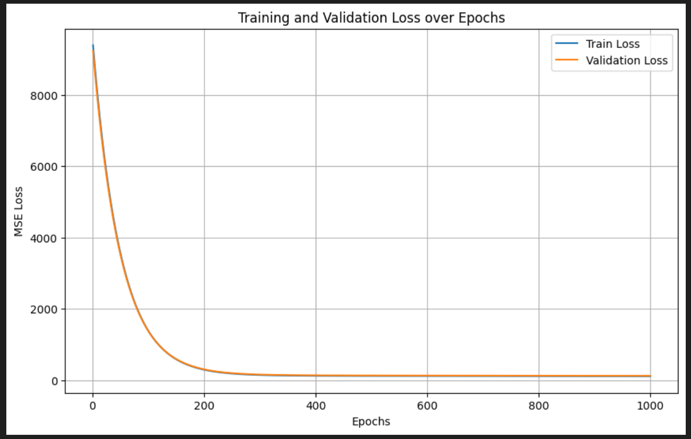

# Regression Model from Scratch in Python

This project demonstrates how to implement a **regression model from scratch** using only core Python libraries (such as `math`, `random`, etc.) without relying on external machine learning frameworks like **scikit-learn** or **TensorFlow**.  

The notebook walks through the step-by-step process of **data preprocessing, model building, training, and evaluation** to understand how regression works internally.

---

## Features
- Implementation of regression algorithm from scratch.
- Training and prediction functions without external ML libraries.
- Performance evaluation using:
  - Mean Squared Error (MSE)
  - Mean Absolute Error (MAE)
  - R² Score
- Visualization of predictions vs. actual values.
- Easy-to-follow Jupyter Notebook for learning.

---


---

## Requirements
To run (locally) the notebook, install the following:
- Python 3.x
- Jupyter Notebook
- Matplotlib
- Numpy (only for data handling)

You can install requirements using:
```bash
pip install matplotlib numpy
````

---

## How to Run

1. Clone the repository:

   ```bash
   git clone https://github.com/Um-E-Salma/regression-model-scratch.git
   ```
2. Navigate to the folder:

   ```bash
   cd regression-model-scratch
   ```
3. Open Jupyter Notebook:

   ```bash
   jupyter notebook
   ```
4. Run the notebook `Regression_model_scratch.ipynb`.

---

## Results

The notebook demonstrates:

* How regression learns the best-fit line.
* Comparison between predicted vs. actual values.
* Error metrics to evaluate model accuracy.

---
## Loss Curve

Below is the training loss curve for the regression model:




---

## Applications

This project is mainly for **learning and educational purposes**, to understand:

* How regression works internally.
* Why libraries like `scikit-learn` simplify ML development.
* Fundamentals of model training and evaluation.

---

## Contributing

Pull requests are welcome. For major changes, please open an issue first to discuss what you would like to change.

---

## License

This project is licensed under the MIT License.

```

---

